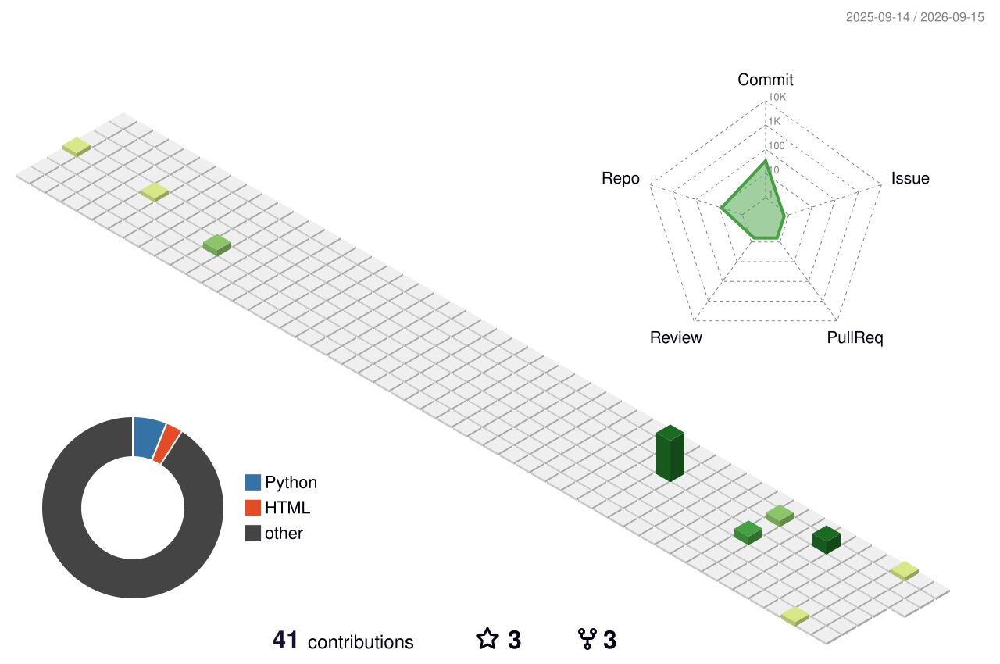

<!--- ═══════════════════════════════════════════════════
     🌈 OMAR ALSHAREEF — Creative GitHub Profile
═══════════════════════════════════════════════════ --->

<!-- 🎬 TOP BANNER — rainbow wave animation -->

  

<!-- 👋 Animated wave + intro -->

  
  
  

  

<!-- 🎨 Floating colorful badges -->

  
  
  
  

<!-- Animated rainbow divider -->

  

<!--- ═══════════════════════════════════════════════════ --->
<!---                         ABOUT                      --->
<!--- ═══════════════════════════════════════════════════ --->

  

<table align="center" width="100%">
<tr>
<td width="55%" valign="top">

  

 

  🚀 Crafting digital products that make a real impact 
  ⚙️ ERPNext & Frappe customization specialist 
  📱 Flutter apps with smooth, beautiful UX 
  ☁️ Cloud infrastructure & Linux systems 
  🎯 Obsessed with clean code & great DX 
  🌍 Based in <b>Riyadh, Saudi Arabia</b>

</td>
<td width="45%" align="center" valign="middle">

 

</td>
</tr>
</table>

<!-- Animated line left-right vibe -->

  

<!--- ═══════════════════════════════════════════════════ --->
<!---                      TECH STACK                    --->
<!--- ═══════════════════════════════════════════════════ --->

  

  
  <b>Languages · Frameworks · Tools</b>
  

  

  

 

<!-- Colorful tech badges row -->

  
  
  
  
  

  
  
  
  
  

  

<!--- ═══════════════════════════════════════════════════ --->
<!---                   FEATURED PROJECTS                --->
<!--- ═══════════════════════════════════════════════════ --->

  

<table>
<tr>
<td width="50%" valign="top" align="center">

### ⚖️ Takamol ERP System
Custom ERPNext for legal ops — workflows, automation & admin.

</td>
<td width="50%" valign="top" align="center">

### 📱 LSC App
Legal services platform with seamless digital experiences.

</td>
</tr>
<tr>
<td width="50%" valign="top" align="center">

### 🚩 Guess The Flags
Educational mobile game that makes geography fun.

</td>
<td width="50%" valign="top" align="center">

### 👻 Snapchat Lenses
Playful AR lenses built in Lens Studio.

</td>
</tr>
</table>

  

<!--- ═══════════════════════════════════════════════════ --->
<!---                   GITHUB ANALYTICS                 --->
<!--- ═══════════════════════════════════════════════════ --->

  

  
  <b>Live stats · Streaks · Languages</b>
  

  
  

 

  

 

<!-- Trophies -->

  

  

<!--- ═══════════════════════════════════════════════════ --->
<!---                 3D + ACTIVITY GRAPH                --->
<!--- ═══════════════════════════════════════════════════ --->

  

  

  

 

  

 

  

  

<!--- ═══════════════════════════════════════════════════ --->
<!---                   SNAKE GAME ZONE                  --->
<!--- ═══════════════════════════════════════════════════ --->

  

  

  <picture>
    <source media="(prefers-color-scheme: dark)" srcset="https://raw.githubusercontent.com/alshareef99-design/alshareef99-design/output/github-contribution-grid-snake-dark.svg"/>
    <source media="(prefers-color-scheme: light)" srcset="https://raw.githubusercontent.com/alshareef99-design/alshareef99-design/output/github-contribution-grid-snake.svg"/>
    
  </picture>

  

<!--- ═══════════════════════════════════════════════════ --->
<!---                      CONNECT                       --->
<!--- ═══════════════════════════════════════════════════ --->

  

  

  
  
  

  
  

 

<!-- Quote of the day -->

  

 

  

  

<!-- 🎬 BOTTOM BANNER -->

  

