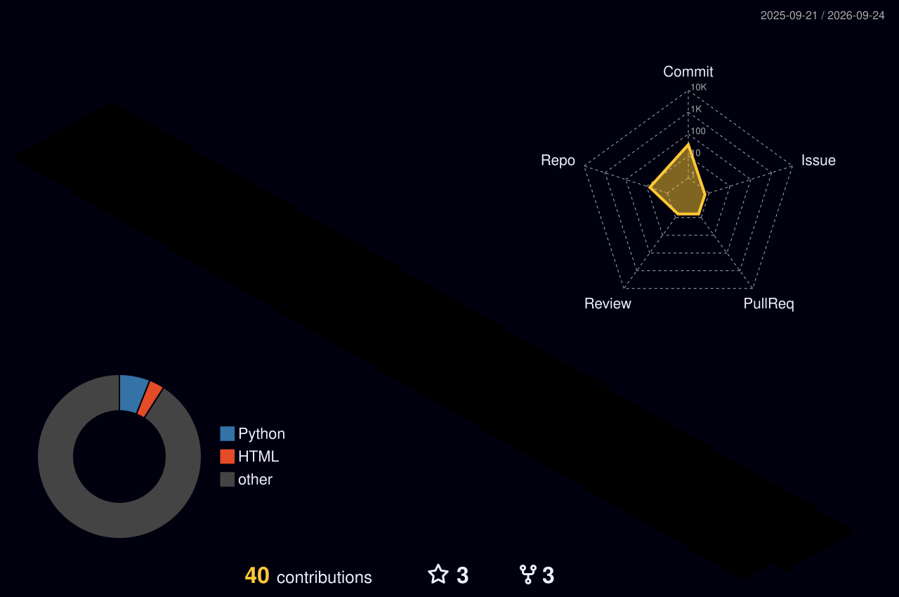

  

<h1 align="center">Hi 👋, I'm Omar Alshareef</h1>

  

---

## 👨‍💻 About Me

- 🚀 Software Developer passionate about impactful digital solutions
- ⚙️ ERPNext & Frappe Customization Specialist
- 📱 Mobile Application Developer (Flutter)
- ☁️ System Administration & Cloud Infrastructure
- 🌍 Based in Riyadh, Saudi Arabia

---

## 🛠 Tech Stack

  

---

## 🚀 Featured Projects

| Project | Description |
|---|---|
| **⚖️ Takamol ERP** | Custom ERPNext for legal operations, workflows & automation |
| **📱 LSC App** | Legal services platform with seamless digital experiences |
| **🚩 Guess The Flags** | Educational mobile game for geography learning |
| **👻 Snapchat Lenses** | AR experiences built with Lens Studio |

---

## 📊 GitHub Stats

  
  

 

  

 

  

---

## 🌐 Connect

  
  
  
  

